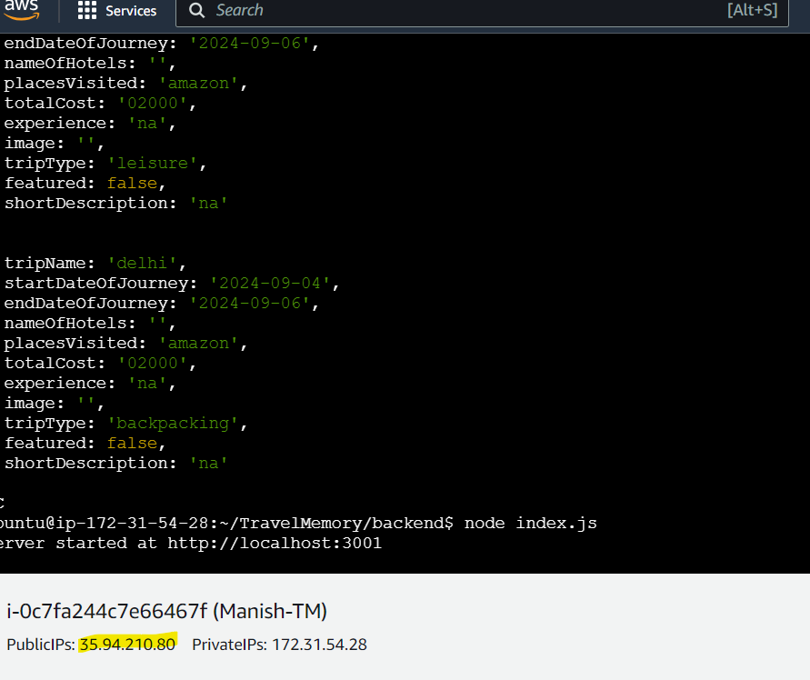

# Travel_memory_application_Deployment

This documentation outlines the steps to deploy the TravelMemory application using the MERN stack (MongoDB, Express.js, React, and Node.js) on an AWS EC2 instance. The deployment includes configuring a reverse proxy with Nginx, setting up a load balancer for scaling, and connecting a custom domain using Cloudflare.
# Architecture Daigram
  

# Project Repository
Access the complete codebase of the TravelMemory application here: [TravelMemory GitHub Repository](https://github.com/UnpredictablePrashant/TravelMemory/tree/main)


# Objective
Setting up the backend running on Node.js.
Configure the frontend built with React.
Ensure communication between the frontend and backend.
Deploy the full application on an EC2 instance.
Facilitate load balancing by creating multiple instances of the application.
Connect a custom domain through Cloudflare.

# Prerequisites
AWS EC2 instance (Linux/Ubuntu).
Node.js and Nginx installed on the instance.
A MongoDB instance, either hosted on a separate server or locally.
A GitHub repository containing the TravelMemory code.
A custom domain name (for use with Cloudflare).
Load balancer configured in AWS.
Basic understanding of the load balancer,target group, AMI,template

# Technologies Used:
Node.js (Backend)
React (Frontend)
MongoDB (Database)
AWS EC2 (Cloud Hosting)
Nginx (Reverse Proxy)
Cloudflare (DNS and Domain Management)

# Deployment Steps
MongoDB setup:
   created a cluster and created a database as Travelmemory in compass which stores the data from the frontend.
   

1. Backend Configuration
Step 1: Clone the Repository
  Opened the terminal and ran
```bash
  $ sudo apt-get update
  ```
  Cloned the TravelMemory repository using git clone.
  Navigated to the TravelMemory directory, where the backend folder is located.
  Ran the command to install the required Node.js packages.
  ```bash 
  $npm install
   ``` 
Step 2: Set up the .env file
  Created a .env file using and added the MongoDB URI and port. For the MongoDB URI, copied the connection string from MongoDB Compass and appended /db_name at the end.
  ```bash 
  $sudo nano .env
  ```
  Once the .env file was ready, started the backend by running node index.js. The backend was configured to run on port 3001.
Step 3: Set up Reverse Proxy with Nginx
  Installed Nginx using (if it wasn't installed already).
  ```bash 
  $sudo apt install nginx
  ```
  Edited the Nginx configuration file using and added proxy settings for the backend running on http://<instance-ip>:3000.
  

  ``` bash 
  $sudo nano /etc/nginx/sites-available/default
  ```
  After updating the configuration file, saved the changes and restarted Nginx to apply the reverse proxy setup.

2. Frontend-Backend Configuration
  Opened another terminal and accessed the EC2 instance.
  Navigated to the frontend folder (frontend/src/) and updated the url.js file using sudo nano url.js, replacing the backend URL with the correct EC2 instance IP and port.
  After updating the URL, navigated back to the root of the frontend folder.

Step 1: Install Dependencies

  Ran to update the package list
  ```bash
  $sudo apt-get update
  ```
  Installed frontend dependencies with
  ```bash 
  $ npm install
  ```
Step 2: Start the Frontend

  Started the frontend application using $npm start.
  Restarted Nginx to ensure all configurations were applied correctly.
  
  

3. Scaling the Application
  Created a template from the existing EC2 instance for scaling purposes.
  Launched a new EC2 instance using the template and configured it similarly to the first instance for both the backend and frontend.
  
  
  

  Set up an AWS Load Balancer:
    Created target groups with both EC2 Instance 1 and Instance 2.
    Configured the load balancer to distribute traffic evenly between the two instances.
    
  
  4.purchased Host from Godaddy and integrated in cloudflare and in Ctype setting Target setup of loadbalancer's DNS
   
   

# Testing
  Stopped one EC2 instance and verified that the load balancer redirected traffic seamlessly to the other instance, ensuring no downtime during testing. Both backend and frontend worked flawlessly through the load balancer.
  This deployment ensures smooth scaling, reverse proxy handling via Nginx, and efficient load balancing across EC2 instances.


   


